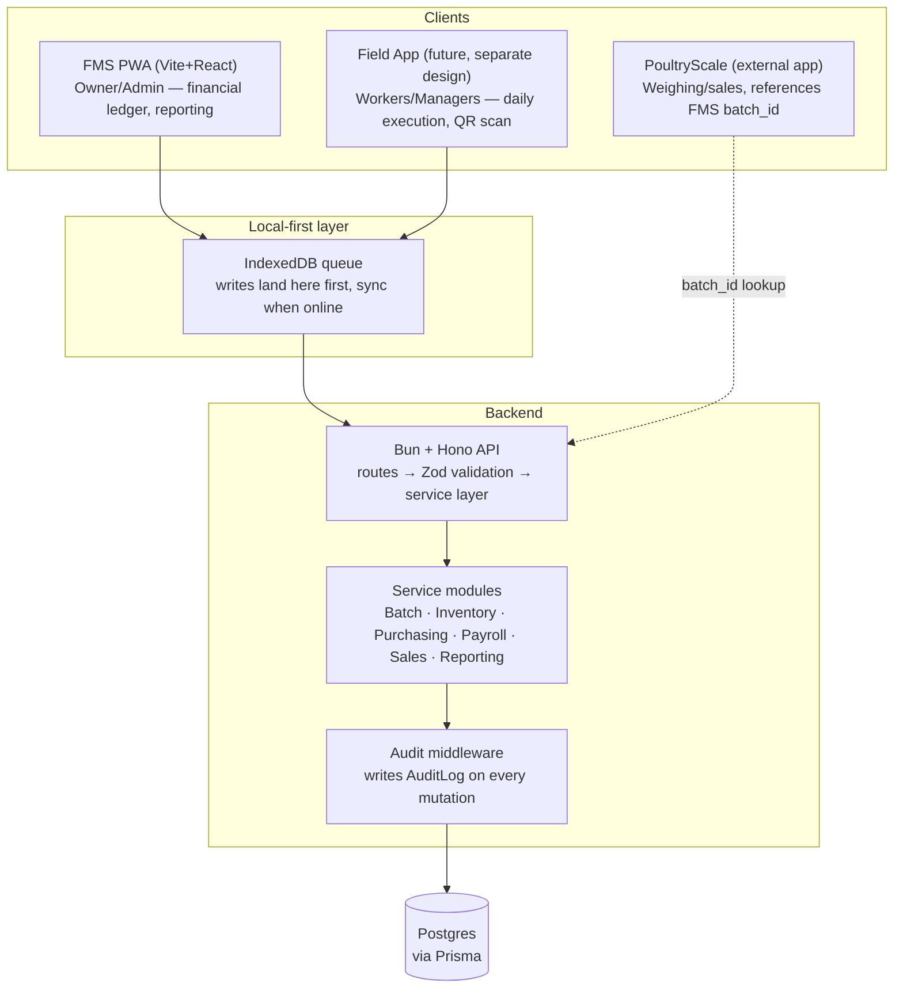

# FMS — System Design Arc

Ties together `docs/PREVIOUS_CONTEXT.md` (original planning), the three feature
designs (inventory, batch management, employee payroll), and `codes/schema.prisma`
into one picture of how the whole system fits together.

## 1. Mission, in one paragraph

ZeroD Farms has no reliable audit trail today — cash expenses go untracked, nobody
knows true per-batch profit, and paper/memory is the system of record. FMS exists to
make same-day, accountable data capture the path of least resistance, not an extra
chore — every design decision so far (append-only ledgers, required actor fields on
every entry, offline-first capture) serves that one goal.

## 2. High-level architecture



Three clients, one backend, one database. The Field App and its QR-scanning flow are
still a separate design conversation ("discuss later"), but the printed-code system
(`inventory-tracking-design.md`) already assumes it as the eventual scanning surface —
manual code entry is the v1 stand-in until it exists.

## 3. Backend layering

```
routes (Hono)  →  Zod schemas (input validation)  →  service layer  →  Prisma  →  Postgres
```

Service modules map roughly to the design docs, and each owns a cluster of tables —
this is the boundary that keeps the codebase from becoming one undifferentiated blob
as it grows:

| Service | Owns | Encodes |
|---|---|---|
| **Batch** | `Batches`, `BatchHouseAllocation`, `BatchHouseBalance`, `MortalityLog` | Placement, brooder→grower transfer, mortality, the batch-closing lifecycle (not yet defined — see §7) |
| **Inventory** | `Item`, `Purchase`, `PurchaseItem`, `StockUnit`, `Asset`, `AssetDepreciation`, `Consumption`, `StockLedger`, `InventoryAdjustment` | Lot costing, code binding, consumption/depletion, depreciation |
| **Treatment** | `Medications`, `Vaccinations`, `EnvironmentRecords`, `WeightRecords` | Links treatment records to actual stock draws via `Consumption` |
| **Payroll** | `PerformanceScoreEntry`, `PayrollRecord`, `Employees` | Point-ledger scoring, monthly clamp-and-compute |
| **Sales** | `Sale`, `SaleItem`, `BirdSale` | Revenue recognition |
| **Money** | `Expense`, `Payment`, `PaymentInstrument` | Cost classification (`cost_type`), cash movement |
| **Reporting** | reads across all of the above | Bird-days allocation (v2), batch P&L, payroll summaries |

Reporting is deliberately read-only against the other modules' tables rather than
owning any of its own — it has no state to be accountable for, only queries.

## 4. Three flows, end to end

**Chicks arrive** → Purchasing records a `Purchase` + `PurchaseItem` (`batch_id` set,
since chicks fund a specific batch from day one) → Batch service creates a matching
`BatchHouseAllocation` (`reason=INITIAL`, into the brooder house) → `BatchHouseBalance`
updates in the same transaction. Financial event and physical event stay two records,
linked by `batch_id`, matching "a batch exists financially before any bird is
weighed."

**A medicine bottle gets used** → Inventory service resolves the scanned/entered
`code` to a `StockUnit` → looks up its `purchase_item.unit_price` for costing →
Treatment service writes a `Consumption` row (`batch_id`, `house_id`, `quantity`) →
`StockUnit.remaining_quantity` decrements, `Medications.consumption_id` links back.
One bottle can span this sequence across several batches and houses over its life.

**Month end payroll** → for each employee, sum `PerformanceScoreEntry.points` for the
month → clamp to `[-10, +20]` → apply to `Employees.salary` → write one
`PayrollRecord` (locked snapshot) → a `Payment` row pays it out, `ref_type` pointing
back at the `PayrollRecord`.

## 5. Offline-first sync

The original stack decision (Vite+React PWA, IndexedDB queue, sync on reconnect) is
why almost every entry table requires an actor (`recorded_by_id`) and a client-set
`date`/`occurred_at` distinct from server `created_at` — a write made in a shed with
no signal has to carry enough information to be trustworthy once it lands, whenever
that is.

**Gap worth closing before real field entry starts**: only `StockLedger` currently has
an `idempotency_key`. Every table a client can write to *offline* — `Consumption`,
`MortalityLog`, `BatchHouseAllocation`, `PerformanceScoreEntry` — needs the same
protection, or a flaky connection retrying a queued sync will double-insert. Same
mechanism as `StockLedger` already models (a client-generated unique key), just not
yet applied everywhere it's needed. Worth doing before writing sync code, not after a
duplicate mortality entry is discovered in production.

## 6. Accountability & audit model

- Every entry that matters names who made it (`recorded_by_id` / `given_by_id` /
  `administered_by_id` / `bound_by_id`) — added specifically because the reference
  schema left several of these blank (see `full-schema-analysis.md`).
- Append-only tables (`Consumption`, `MortalityLog`, `BatchHouseAllocation`,
  `PerformanceScoreEntry`, `StockLedger`, `Purchase`/`PurchaseItem`, sales, payments)
  are never edited — a correction is a new offsetting row. This needs to be enforced
  at the application layer (no `UPDATE`/`DELETE` code path exposed for these tables),
  since Postgres/Prisma won't stop a service function from doing it.
- `AuditLog` covers the mutable tables (`Item`, `Batches`, `Employees`, `StockUnit`
  status/location changes, etc.) where edits are legitimate and history still matters.
  **Recommend a Prisma middleware** (`$use` / extension) that writes `AuditLog`
  automatically on every update to a registered model, rather than scattering manual
  audit-write calls through service code — a forgotten call is a silent gap, a
  middleware can't be skipped by accident.
- Nothing gets hard-deleted. `is_active` flags exist specifically so deactivating a
  Profile/Item/Supplier/Customer never breaks a foreign key or destroys history.

## 7. What's still genuinely undecided

- **Batch-closing trigger**: what actually moves `Batches.status` from `RUNNING` to
  `CLOSED`/`SOLD`, and does that action automatically fire `AssetDepreciation`
  computation and finalize the month's bird-days allocation? This has been flagged
  three times across the design docs and is worth resolving before building the Batch
  service, since several other features assume it exists.
- **Bird-days allocation engine** — intentionally v2, needs 2-3 batches of real
  overlapping data to validate against before writing the formula.
- **Auth/role enforcement** — the schema has the actors (`UserRole`,
  `EmployeeRoleNames`) but no permission layer yet; matches the original "single-user
  for v1" plan, becomes required once a second person starts entering data.
- **ORM/runtime confirmation** — `schema.prisma` validates cleanly, but that only
  proves the schema syntax is correct (the validator is a Rust/WASM engine,
  runtime-agnostic). It does **not** confirm Prisma's client generation and query
  engine behave correctly under Bun specifically — that needs an actual
  `prisma generate` + a smoke-test query run with Bun before fully committing over
  Drizzle.
- **Postgres hosting** (Supabase/Neon/Railway/self-hosted) — unchanged open item from
  the original plan.
- **Field App design** — the mobile scanning/execution app is referenced throughout
  as the eventual consumer of QR codes and daily logging, but has no design of its own
  yet, by your own choice to defer it.

## 8. Verification so far

```
cd codes && npx prisma validate --schema=./schema.prisma   # passes
```
No migration has been generated, no database exists, no backend or frontend code has
been written — this and the three feature docs are the complete design surface so
far. Next concrete step, when ready, is `prisma migrate dev` against a real Postgres
instance plus a `prisma generate` + Bun smoke test to close the ORM confirmation gap
above.
